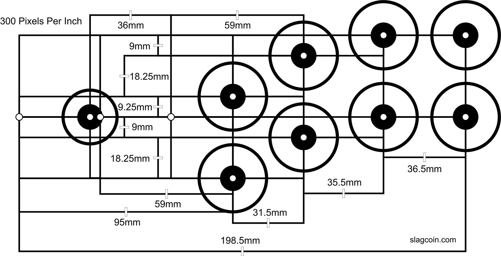
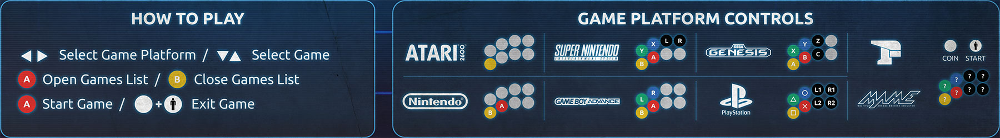
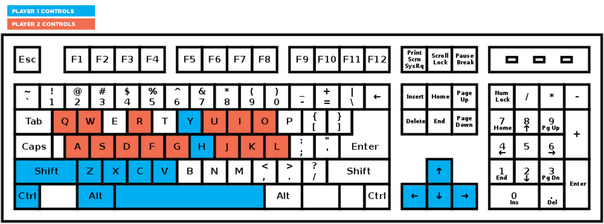
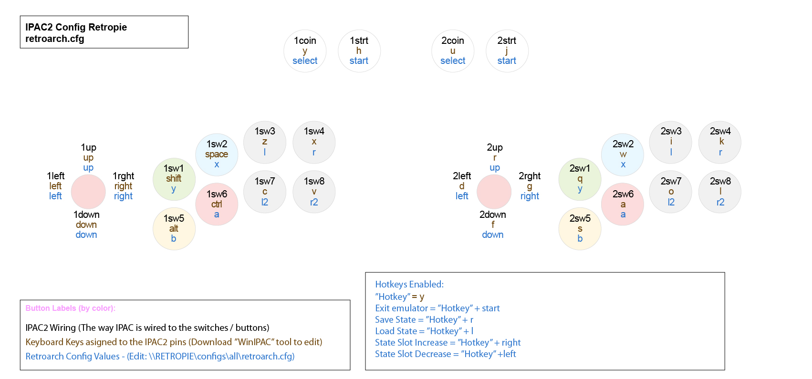

#Guide: Setting Up a RetroPie controls using IPAC2 Controller Extensive Tutorial + Preconfigured files.

**Introduction**
---

Because button configuration is still a rather complicated topic for many new coming enthusiasts, I decided to share my own experience in a specially dedicated post rather than repeating myself in different places on the forum. Maybe what I have to share will be of benefit to some people.

My intention is to describe exactly how I configured my own arcade and share with you some preconfigured files which will allow you to replicate the design I used.
In the beginning, I will talk a bit about some hardware and design choices I had to take before I even started thinking about configurations. I promise it will make sense in the end.

I will also share with you the template document which I made to keep track on the button positions, while I was configuring the controls for the different platforms. I hope it will be of use to people which plan to build an arcade with a different button scheme and can not simply copy the preconfigured files.

If you want to download all of the files shared on this post, just go straight to the end of it and you will find a list.

I want you to keep in mind that even if you have the same button panel and you decide to follow me step by step and use exactly the same set of emulators I picked up, there is no guarantee that everything will work straight away. Mainly when it comes to an individual per ROMS control configurations or specific ROMS versions chosen. Try to delve more into the official wiki pages as they are surely more informal.

**Step 1 : Button Layout**
---

Before ordering all of the hardware I had to take a decision which platforms I would use on the arcade cabinet, how many buttons I would need and how would I arrange them.

Out of all emulators available inside RetroPie, I chose the following 8:

* Atari 2600
* FBA
* Game Boy Advance
* Mame Libretro
* Megadrive
* NES
* Playstation
* SNES

The RetroPie based arcades I have seen rarely use more than 6 action buttons per player + 2 for start and select (8 in total for each player). This would have been sufficient enough for all game platforms I planned to use except for Playstation. To be able to map all of the buttons properly I needed 2 more buttons for each player. In total 10 buttons per player.

I have also seen some people doing additional customization to their arcades by adding special buttons for starting and exiting a game. This would require additional programming work so I decided to rely on the default settings as much as I can. I didn’t want to complicate things further.

Now that I knew I need a 20 button set I started looking for a good button layout which I can use and I picked this one:

(You can find other button layouts available here: http://www.slagcoin.com/joystick/layout.html)

Before actually buying the buttons I put a lot of thought about what color buttons I want to install on the arcade. I see on the internet that a lot of people are using randomly colored buttons, which I find very impractical. I wanted the mapping to be intuitive and easy to understand so I specifically decided to order buttons colored in the Super Nintendo color scheme. My reasoning is this:

* Most people would immediately associate the button position and function as this scheme is a classic on its own.
* It would be easier to communicate the button functions to new players in a manual.

**Step 2 : The hardware I bought**
---

The controller set I ended up buying included pretty much most of what I needed:
https://www.arcadeworlduk.com/products/Arcade-Joysticks-Buttons-And-Wiring-Kit-No-2.html

The only difference is that I contacted the seller and specifically asked for these button colors: 2x Yellow, 2x Blue, 2x Red, 2x Green, 2x White, 8x Black, 2x White Player start buttons, 2 x Balltop joysticks (Red)

The rest of the hardware should be familiar to you all: Raspberry Pi 3, Power supply, SD Card, Monitor, Speakers and one peculiarity: USB Dual Extension cable (https://goo.gl/9PvyJR)

I will briefly tell you what was this about as I have not seen anyone else use it. This thing is totally optional, you don’t need to make it if you don't want to.
When the Arcade is finished you will end up using only one of the USB port of the PI. When you close the cabinet you won't be able to access it easily. Not without an extension cable. I made a discrete hole on the lower side of the control panel and installed the USB ports there. Through them, I can add more roms to the SD card and plug in two additional Xbox controllers for some sweet 4 player arcade gaming.

**Step 3 : Deciding on the button usage for each game platform**
---

Now that I knew how many buttons would I use and which consoles I'm going to emulate I started planning the mapping of the buttons for each console. It is crucial to make these decisions in the beginning and write them down in an easy to understand way if you want to keep track on what is going on while you are editing the config files for each console later on. If you don't do it you can easily get lost in the process.

First of all, I wrote down which buttons I plan to use for each console. Later when everything was wired I had time to do some testing and rearrange some buttons. These are the control schemes I decided to program for each emulator.

This is what the instruction manual for my arcade looks like. It is glued on the cabinet, just to the screen. I think it's descriptive enough.

And this is how the control panel looks like. I placed additional hint icons beside each button.
I had gone through a lot of testing later on and I can recommend this mapping to anyone.

As you can see the controls for the MAME and FBA emulators are not specified as each individual game has a widely different control scheme. Because of this problem I had to do a custom remapping for certain games to fix the button position to either match their original layout (Street Fighter Series) or to make them match the commonly used layout for “Hit, Jump, Special” buttons (Metal Slug series, X-men). I will describe this later on.

**Step 4 : IPAC2 Button wiring**
---

When the cabinet was finally built it was time to wire the button switches to the IPAC2 Controller.

I assume that most of you are already familiar with the functionality of the IPAC2, but I will briefly describe what it is and how it is tied to the RetroPie.

The IPAC2 is a board which can be programmed to act as a keyboard. Keyboard buttons are assigned to each pin on the board. The pins are wired to the switches on the button panel. When the button is pressed it makes a contact and the IPAC sends a signal through USB cable to the Raspberry Pi telling him which keyboard key has been pressed. The RetroPie emulator then “looks” inside the configuration file (.cfg) “sees” which RetroArch control is assigned to that button and executes it.

If you are trying to replicate my button configuration it is important to wire the pins to the right buttons. This is how my buttons are wired to the IPAC2 board:

I advise you to look for more information about how exactly the cables connect to the switches here https://www.ultimarc.com/ipac2.html or in some youtube video tutorial.

**Step 5 : IPAC2 Configuration**
---

Now that the IPAC2 is connected to the buttons it is time to configure it.
To do that you will have to use a software called WinIpac
https://www.ultimarc.com/download.html

Through it, you can assign any keyboard key to a pin.

Things are pretty straight forward. You have to connect the IPAC2 board to your PC through USB Cable. When you start the software it will recognize the board and will display it on the left. You can select pins on the image and choose a key which you want to assign to it. It is important to set your IPAC2 to work as KEY, not as a GAMEPAD. When you are ready you press `File -> Force Board Reconfigure`

If you want to replicate my configuration and make it work you will have to assign specific keyboard keys to the IPAC2 pins. Fortunately, WinIPAC can export .xml configuration files, which can then be imported to other boards, thus saving you all the manual work. Here is mine configuration file:

[IPAC2_Config_v4.xml](files/IPAC2_Config_v4.xml)

What you have to do after you download the file is to start WinIPAC, open the `File -> Import` menu and browse for the file. Open it. Then click on `File -> Force Board Reconfigure`. It is done, your board is now configured the same way as mine.

On this image, you can see which Keyboard keys are now assigned to the IPAC board and respectively to the buttons.

Just to wrap it up, here is another image showing you all the keyboard keys used.

**SIDE NOTE:**
IPAC2 can be switched to behave as a GAMEPAD controller. I have seen many discussions about how it would be easier to make everything work if you switch to that mode. The problem as I found out is this. If you switch the IPAC2 to act as a GAMEPAD RetroArch would recognize it as a single controller. You can not map two players on it. You would technically need another IPAC2 board to do that. So don’t waste your time and forget about it.

**SIDE NOTE:**
I have to clarify that in the very beginning I started working on the working on this I stumbled on some problems with the mapping. For some reason, I eventually changed the keys used for Start and Select with different keys from the keyboard. I don’t recall what exactly was the problem for me, but in the end, everything worked out just fine.

**Step 6 : Planning the Button Mapping**
---

This is where things get really complicated for the average user.

You might already know that Retropie can use different button mapping for each emulator.
I don’t want to get into too many details, especially because there is a very detailed wiki page on the subject: https://github.com/RetroPie/RetroPie-Setup/wiki/RetroArch-Configuration
(Read the “Hardcoded Configurations” section)

In a nutshell, Retropie has 3 levels of button configurations which can be overwritten when you start a certain emulator or a certain game. The Config Hierarchy goes like this:
* Global Settings
* System Specific
* ROM Specific

While you are still inside the main menu the Global Settings apply. When you start an emulator which does not have System Specific settings written for it the Global ones keep on working. If you have a custom configuration file written for a specific system and you start the emulator, the Global Settings are overwritten and the System Specific Settings apply. If you exit the emulator the Global Settings start working again. If you start a specific ROM which has its own custom mapping both previous settings are overwritten.

This is what makes things so complicated and hard to track.
For this reason, I made myself a visual map of the button layout of each individual console and specific ROMS. The previous two images I showed you are exactly that in an early stage. It is nothing that special really. The template is made in Adobe Illustrator. It contains a set of images, showing the button layout of my arcade and inside each button, there are tree values written. These values tell you the name of the switches, the Keyboard Keys assigned to each switch and the Retroarch key values tied to the Keyboard input.
I have made a separate copy of this layout for each emulator.

Here is an example. This is the default retroarch configuration map.
These controls will be active in the Main Menu of the RetroPie. They will also be automatically assigned to each new emulator you decide to use beside the 8 I’m using.

Here is a short description of what you should keep attention to in this image:
* In the upper left corner, there is a title telling you for which Game Platform these controls Apply.
* The text in BLACK tells you how are the button switches wired to the IPAC2 board. Once set up these values never change.
* The text in BROWN tells you which Keyboard Keys has been assigned to each pin on the IPAC2 board. Once set up these values never change.
* The text in BLUE tells you which RetroArch key values are tied to these Keyboard Keys. These values can be rearranged inside the different.cfg files! By making copies of the default .cfg file and rearranging the values in BLUE you are switching the buttons functions for each emulator!!!!
* Button Labels section is basically a legend. Take notice of the blue text, though, as it will tell you in which directory you should copy the edited .cfg file!
* Hotkeys Enabled section. RetroPie has a set of shortcuts for hidden functions like saving/loading a game and others. These functions can be disabled for specific gaming platforms or changed in such a way to keep being constant even if you have rearranged their position while editing some of the other buttons.

Finally, here is an archive containing my original Illustrator File + Image exports of each control scheme I mapped.

[RetroArch Configuration Map Template](files/retroarch_configuration_map_template/)

 Download it and look through all of the images and try to compare them. Also, don’t forget to look at the image I shared in Step 3. It will show you the same button arrangement, but without the additional information.

In the next step, I will give you a quick recap of how you can manually change the configuration files for each game platform and will than share the files I’m using.

**SIDE NOTE**
As you can see in the archive I myself ended up with 12 different maps for my Arcade.
* 1 Global Mapping  - Functioning in the main menu of the retropie.
* 8 System Specific Mappings
* 3 ROM Specific Mappings (Metal Slug series, Street Fighter series, Golden Axe, X-men)

In total, I have made 28 configuration files. (.cfg)
The number of configuration files is greater than the mapping schemes because certain game series are using a single mapping scheme, but the actual configuration file had to be duplicated several times for each individual ROM. The name of the .cfg file had to be changed to reflect the name of the ROM it should be tied to. For example, all Street Fighter Games, including the Marvel fighting games (11 in total) are using the same ROM Specific mapping, but each ROM has its own copy of this very same file.

